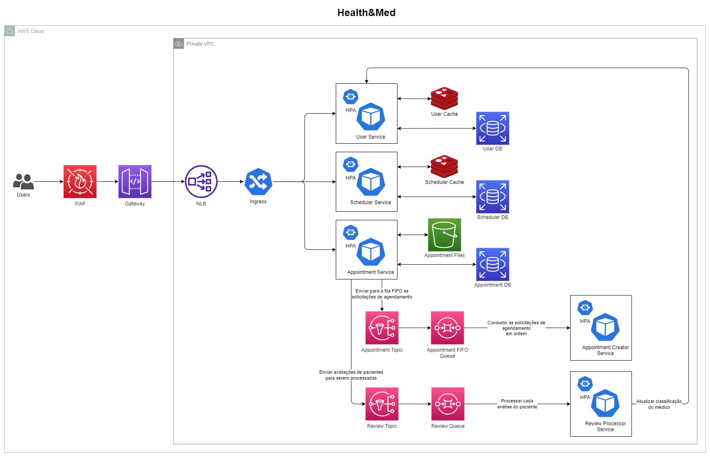

  

# Health&Med Org

Este é um projeto que ajudará pacientes e médicos a gerenciar suas consultas e relatórios médicos.

## Arquitetura

O diagrama a seguir mostra a arquitetura do projeto. Ele foi criado com os seguintes requisitos em mente:

- Alta disponibilidade: O sistema deve estar disponível 24/7.
- Escalabilidade: O sistema deve ser capaz de escalar horizontalmente para lidar com um grande número de usuários (20k de pacientes ao mesmo tempo).
- Segurança: O sistema deve ser seguro para garantir a confidencialidade e integridade dos dados.

## Observabilidade

Para monitorar o sistema, usamos o Prometheus e Grafana. O Prometheus coleta os dados do sistema e o Grafana permite visualizar os dados coletados. Desta forma, é possível acompanhar o desempenho do sistema e identificar possíveis problemas. Caso haja algum problema, podemos corrigi-lo imediatamente e/ou criar alertas para avisar os times responsáveis através do AlertManager e de outro serviço de comunicação, como Slack ou Teams por exemplo.

## Tecnologias

Para criar este projeto, usamos as principais tecnologias:

- [AWS](https://aws.amazon.com/)
- [Kubernetes](https://kubernetes.io/)
- [Terraform](https://www.terraform.io/)
- [Docker](https://www.docker.com/)
- [GoLang](https://golang.org/)

## Infraestrutura como Código

Este projeto tem os seguintes serviços:

### [EKS Cluster IaC](https://github.com/jfelipearaujo-healthmed/eks-cluster-iac)

Neste serviço, provisionamos o cluster EKS e outros recursos usando o Terraform.

### [Database IaC](https://github.com/jfelipearaujo-healthmed/database-iac)

Neste serviço, provisionamos o banco de dados e outros recursos usando o Terraform.

Os bancos de dados são:

- UserDB: armazena dados de usuários.
- ScheduleDB: armazena dados das agendas dos médicos.
- AppointmentDB: armazena dados das consultas e outros dados relacionados à consulta.

Também usamos um cache Redis para evitar a sobrecarga do banco de dados e acelerar a consulta de algumas informações.

Para ver as tabelas, por favor, verifique [esta](../docs/database.md) página.

### [Queues & Topics IaC](https://github.com/jfelipearaujo-healthmed/queues-topics-iac)

Para permitir que um grande número de usuários acesse o sistema, usamos as Filas e Tópicos da AWS para gerenciar a criação de consultas e poder calcular corretamente a classificação (nota) de cada médico.

### [API Gateway IaC](https://github.com/jfelipearaujo-healthmed/api-gateway-iac)

Para permitir que o projeto seja dimensionado horizontalmente, usamos o API Gateway e um NLB para manipular o tráfego para um Ingress Controller em execução no cluster EKS.

## Microserviços

### [User Service](https://github.com/jfelipearaujo-healthmed/user-service)

Este serviço é responsável pelo gerenciamento de usuários, ele criará, atualizará, obterá e excluirá usuários (pacientes e médicos).

Além disso, permite que os pacientes pesquisem médicos por especialidade, cidade, estado, etc.

### [Schedule Service](https://github.com/jfelipearaujo-healthmed/scheduler-service)

Este serviço é responsável pelo gerenciamento das agendas dos medicos, ele criará, atualizará, obterá e excluirá agendas.

### [Appointment Service](https://github.com/jfelipearaujo-healthmed/appointment-service)

Este é o serviço principal do projeto, ele criará, atualizará, obterá e excluirá as consultas.

Ele também permitirá as seguintes ações:
- Confirmar ou recusar uma consulta
- Cancelar uma consulta
- Adicionar feedback a uma consulta
- Obter feedbacks
- Carregar arquivos para uma consulta
- Criar um acesso de arquivo
- Obter os arquivos anexados a uma consulta
- Criar um relatório médico
- Obter os relatórios médicos

### [Appointment Creator Service](https://github.com/jfelipearaujo-healthmed/appointment-creator-service)

Este serviço é responsável por lidar com a criação de consultas e evitar conflitos entre o possível grande número de usuários tentando criar consultas ao mesmo tempo para o mesmo médico. Para executar esta tarefa, usamos um Tópico FIFO e uma Fila FIFO para centralizar a criação de consultas e permitir a ordem correta das consultas, esses tópicos e filas conseguem entregar para a aplicação na ordem de chegada.

### [Review Processor Service](https://github.com/jfelipearaujo-healthmed/review-processor-service)

Este serviço é responsável pelo processamento de cada feedback feito por cada paciente e pelo cálculo da classificação de cada médico. Para permitir uma melhor maneira de calcular a classificação, usamos o Tópico e uma Fila para centralizar os feedbacks e segregar o poder de processamento necessário para calcular a classificação longe do serviço de agendamento.

## Rotas

Se você quiser entender melhor as rotas, consulte [esta](../docs/routes.md) página.
